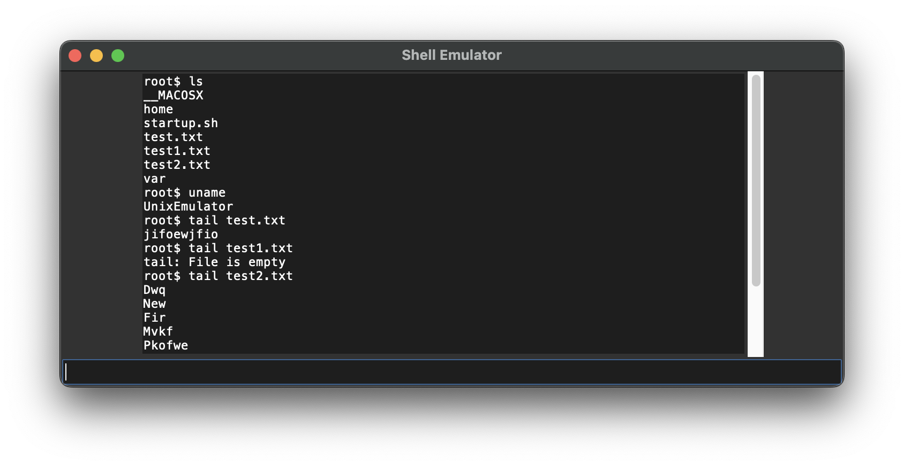

## Клонирование репозитория
Склонируйте репозиторий с исходным кодом и тестами:
```bash
git clone https://github.com/weirdflexer/scm-mirea
cd scm-mirea/task1
```

## Запуск
Запуск эмулятора
```bash
python core.py
```

## Пример работы приложения


## Структура проекта
```bash
tests
 - tests.py # тесты
app.csv # логи проекта
config.ini # конфиг для эмулятора
core.py # ядро эмулятора
virtual_fs.zip # виртуальная файловая система
```

## Запуск тестов
```bash
python -m unittests tests/tests.py
```

## Вывод тестов
```
...
----------------------------------------------------------------------
Ran 3 tests in 0.003s

OK
```