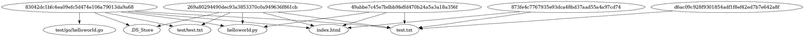

# Git Commit Dependency Graph Visualizer

## Описание

**Git Commit Dependency Graph Visualizer** — это инструмент командной строки для визуализации графа зависимостей коммитов в Git-репозитории, включая транзитивные зависимости. Он строит граф перед заданной датой и показывает зависимость коммитов от файлов и папок.

Граф генерируется в формате PlantUML и сохраняется как изображение в формате puml.

## Возможности

- **Построение графа зависимостей** для коммитов, перед заданной датой.
- **Показывает зависимость от файлов и папок**
- **Полное покрытие кода тестами** с использованием `unittest`.

## Требования

- **Python 3.6+**
- **Git**, установленный и доступный в `PATH`.
- **yaml** для парсинга конфига.

## Установка

1. **Клонируйте репозиторий или скопируйте файлы проекта**:

   ```bash
   git clone https://github.com/weirdflexer/scm-mirea
   ```

2. **Перейдите в директорию проекта**:

   ```bash
   cd scm-mirea/task2
   ```

3. **Установите необходимые зависимости** (если они не установлены):
   - **Установка `pyYAML`** (для чтения зависимостей):

     ```bash
     pip install pyYAML
     ```

## Конфигурация

Создайте XML-файл конфигурации `config.xml` в корневой директории проекта. Пример содержимого:

```yaml
visualizer_path: "/usr/local/bin/plantuml"
repository_path: "/Users/aleksandrvolentir/test"
output_path: "./dependencies_graph.puml"
start_date: "2024-01-01"
```

- **repo_path**: Путь к локальному Git-репозиторию, для которого необходимо построить граф зависимостей.
- **output_path**: Путь и имя выходного файла изображения графа (должен оканчиваться на `.puml`).
- **start_date**: дата до которой идет парсинг зависимостей.

## Использование

Запустите скрипт `main.py`, указав путь к файлу конфигурации:

```bash
python3 main.py config.yaml
```

После успешного выполнения вы увидите сообщение:

```
Граф зависимостей создан:
```

Сгенерированный граф будет сохранен по пути, указанному в `output_path` файла конфигурации.

## Пример работы скрипта



## Тестирование

Чтобы запустить тесты и убедиться в корректной работе скрипта, выполните:

```bash
pytest -m unittest tests/tests.py
```

Вы должны увидеть вывод, подтверждающий успешное прохождение всех тестов.

## Структура проекта

- **main.py**: Основной скрипт для визуализации графа зависимостей.
- **tests/tests.py**: Набор тестов для проверки корректности работы функций.
- **config.yaml**: Файл конфигурации с настройками для скрипта.
- **README.md**: Документация проекта.

## Требования к окружению

Убедитесь, что в вашем окружении:

- **Git** установлен и доступен в командной строке.
- **Python 3.6** или более поздней версии.

## Вывод тестов
```
...
----------------------------------------------------------------------
Ran 3 tests in 0.001s

OK
```
